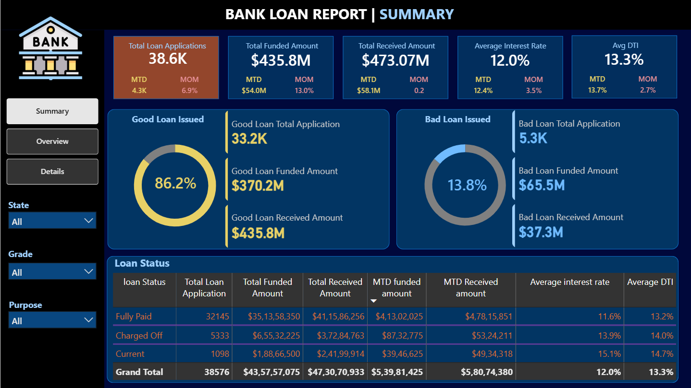
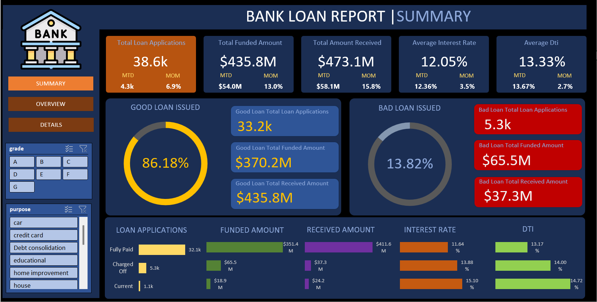
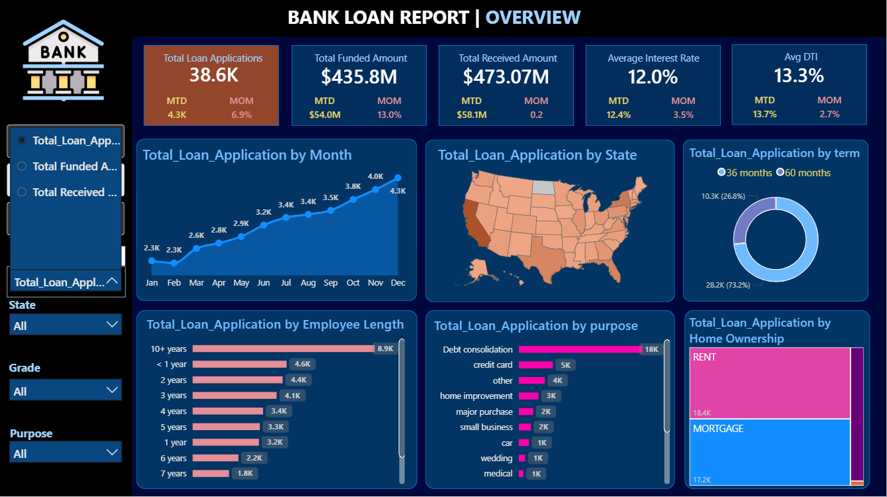
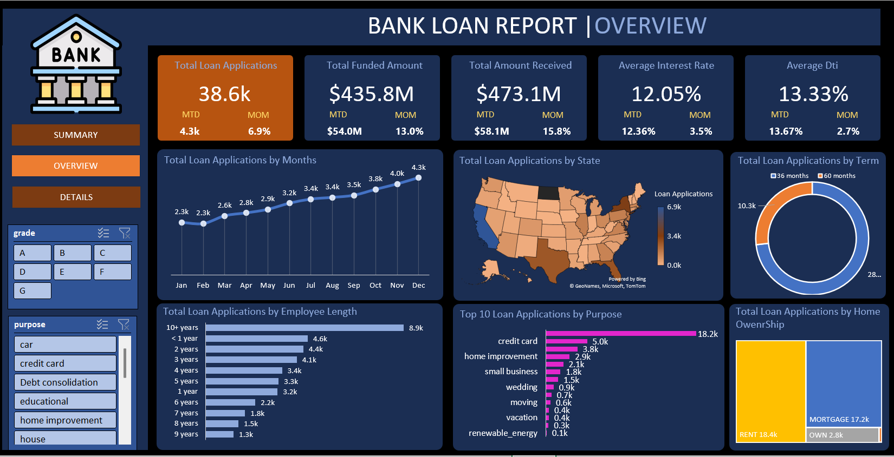
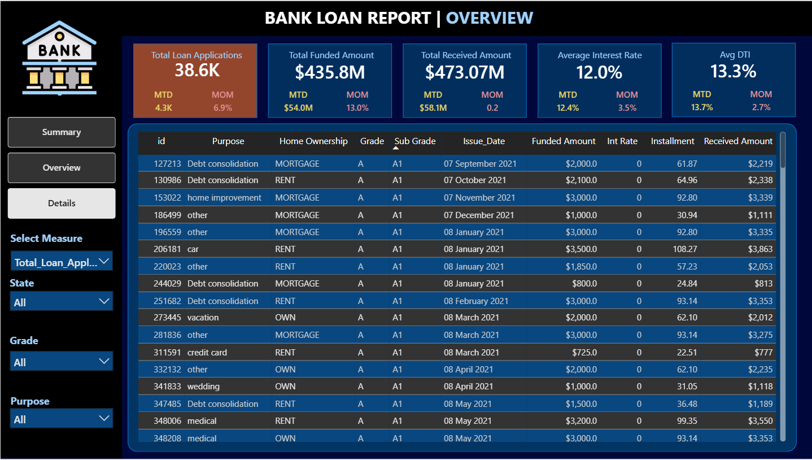

# 🏦 Bank Loan Analytics Dashboard

> **End-to-End Banking Analytics Project** built using **SQL Server, Excel, and Power BI** to analyze loan performance, borrower behavior, portfolio quality, and lending KPIs. This project demonstrates the complete analytics lifecycle—from data cleaning and SQL analysis to interactive dashboards and business insights.

---

# 📌 Problem Statement

Banks require a centralized analytics solution to monitor lending performance, evaluate portfolio quality, identify loan trends, and support data-driven business decisions.

This project analyzes loan applications, funded amounts, repayments, borrower profiles, loan status, and credit risk through interactive dashboards and KPI reporting.

---

# 🛠 Tech Stack

| Category | Technologies |
|------------|-------------|
| Database | SQL Server |
| Spreadsheet | Microsoft Excel |
| BI Tool | Power BI |
| Power BI | DAX, Power Query, Data Modeling |
| Excel | Pivot Tables, Pivot Charts, Power Pivot, Power Query, Slicers |

---

# 📊 Dashboard Pages

## 📍 Summary Dashboard

- Total Loan Applications
- Total Funded Amount
- Total Amount Received
- Average Interest Rate
- Average Debt-to-Income Ratio (DTI)
- Good Loan vs Bad Loan Analysis
- Loan Status Summary

---

## 📍 Overview Dashboard

- Monthly Loan Trends
- Regional Analysis by State
- Loan Term Analysis
- Employee Length Analysis
- Loan Purpose Analysis
- Home Ownership Analysis

---

## 📍 Details Dashboard

- Complete Loan Records
- Borrower Information
- Loan Performance Details
- Interactive Filtering & Drill-down

---

# 💻 SQL Analysis

The project includes SQL scripts covering:

- Database Setup
- Data Import
- Data Quality Checks
- Data Cleaning
- KPI Development
- Good Loan vs Bad Loan Analysis
- Loan Status Analysis
- Monthly Revenue & Funding Trends
- State-wise Analysis
- Loan Purpose Analysis
- Home Ownership Analysis
- Employee Length Analysis
- Loan Term Analysis
- Aggregate Functions
- CASE WHEN
- GROUP BY
- ORDER BY
- Date Functions
- Common Table Expressions (CTEs)
- Window Functions

---

# 📊 Excel Dashboard

The Excel dashboard includes:

- KPI Cards
- Pivot Tables
- Pivot Charts
- Power Pivot
- Power Query
- Interactive Slicers
- Timeline Filters
- Conditional Formatting
- Good Loan vs Bad Loan Analysis
- Loan Status Summary
- Dynamic Reporting

---

# 📊 Power BI Dashboard

The Power BI dashboard consists of **3 interactive report pages** featuring:

- Summary Dashboard
- Overview Dashboard
- Details Dashboard

### Features

- KPI Cards
- DAX Measures
- Power Query
- Data Modeling
- Interactive Slicers
- Drill-through
- Cross Filtering
- Dynamic Filtering
- Line Charts
- Filled Map
- Donut Chart
- Bar Charts
- Tree Map
- Table Visuals

---

# 📈 Key KPIs

- 💰 Total Loan Applications
- 💵 Total Funded Amount
- 💳 Total Amount Received
- 📊 Average Interest Rate
- 📈 Average Debt-to-Income Ratio (DTI)
- ✅ Good Loan Percentage
- ❌ Bad Loan Percentage
- 🏦 Good vs Bad Loan Applications
- 🌍 State-wise Loan Performance
- 📅 Monthly Loan Trends

---

# 💡 Key Business Insights

- Analyzed **38,576 loan applications** with a total funded amount of **$435.76M** and total repayments of **$473.07M**, indicating a healthy lending portfolio.
- **86.18%** of loans were classified as **Good Loans**, while only **13.82%** were categorized as **Bad Loans**, reflecting strong overall portfolio quality.
- Loan applications steadily increased throughout the year, with **December** recording the highest number of applications, funded amount, and repayments.
- **36-month loans** accounted for nearly **73%** of all applications, showing customers strongly prefer shorter repayment terms.
- **Debt Consolidation** emerged as the most common loan purpose, followed by **Credit Card refinancing**, highlighting major borrower financing needs.
- Customers with **Mortgage** and **Rent** home ownership statuses generated the highest number of loan applications, while homeowners represented the smallest borrower segment.

---

# 📸 Dashboard Preview

## 📊 Summary Dashboard



---

## 📊 Summary (Excel Version)



---

## 📈 Overview Dashboard



---

## 📈 Overview (Excel Version)



---

## 📋 Details Dashboard



---

## 📋 Details (Excel Version)


---

# 📂 Repository Structure

```text
📦 Bank-Loan-Analytics
│
├── 📂 Data
│   ├── financial_loan.csv
│   └── financial_loan_data.xlsx
│
├── 📂 SQL
│   └── Finance_query.sql
|   |__ Query Doc.docx
│
├── 📂 Dashboard
│   └── Bank_Loan_Report.pbix
│
├── 📂 Images
│   ├── Summary.png
│   ├── Summary_Excel.png
│   ├── Overview.png
│   ├── Overview_Excel.png
│   ├── Details.png
│   └── Details_Excel.png
│
├── 📂 Documents
│   ├── Problem Statement.docx
│   ├── Domain Knowledge.docx
│   └── Terminologies in Data.docx
│
└── README.md
```

---

# ⭐ Project Highlights

- End-to-End Banking Analytics Project
- SQL Server Data Analysis
- Advanced SQL Queries
- Data Cleaning & Quality Checks
- KPI Development
- Professional Excel Dashboard
- Power Pivot & Power Query
- Interactive Power BI Dashboard
- DAX Measures
- Data Modeling
- Business Intelligence Reporting
- Loan Portfolio Analysis
- Good vs Bad Loan Analysis
- Business Insight Generation

---

# 👨‍💻 Author

### Divyesh Gandhi

📧 Email: gandhidivyesh09@gmail.com

🔗 LinkedIn: https://linkedin.com/in/divyesh-gandhi23

💻 GitHub: https://github.com/code-with-divyesh

---

## ⭐ If you found this project useful, don't forget to Star the repository!